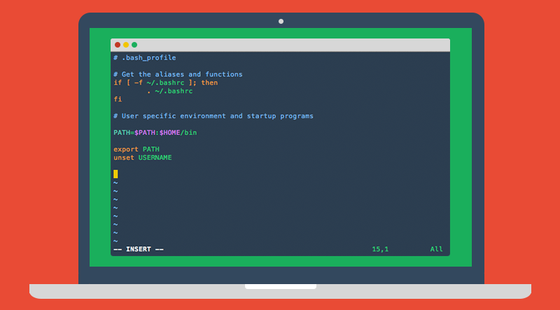

> The best colorful flat theme for your favorite editor and terminal emulator.

## Contents
* [Color Palette](#color-palette)
* Editors
  * [Atom](#atom)
  * [Jetbrains Editors](#jetbrains-editors)
  * [Sublime Text](#sublime-text)
  * [Vim](#vim)
  * [Visual Studio Code](#visual-studio-code)
  * [Xcode](#xcode)
* Terminal Emulators
  * [GNOME Terminal](#gnome-terminal)
  * [iTerm](#iterm)
  * [Terminal.app](#terminalapp)
  * [Termux](#termux)
  * [Xfce Terminal](#xfce-terminal)
  * [XTerm](#xterm)
* Others
  * [CSS](#css)
* [Contributing](#contributing)
* [About](#about)

## Color Palette

Palette      | Hex       | RGB           | HSL                  | Sample
---          | ---       | ---           | ---                  | ---
Background   | `#2b3e50` | `43 62 80`    | `209.2° 30.1% 24.1%` | 
Current Line | `#243443` | `36 52 67`    | `209° 30.1% 20.2%`   | 
Selection    | `#19242f` | `25 36 47`    | `210° 30.6% 14.1%`   | 
Foreground   | `#f8f8f2` | `248 248 242` | `60° 30% 96%`        | 
Comment      | `#5c98cd` | `92 152 205`  | `208.1° 53.1% 58.2%` | 
String       | `#e6db74` | `230 219 116` | `54.2° 69.5% 67.8%`  | 


## Editors

### [Atom](https://atom.io/)


1.	Go to **Atom -> Preferences...**
2.	Then select the **Install** tab
3.	Switch to the **Themes**
4.	Type **Lucario** in the search box

See Lucario in [atom.io page](https://atom.io/themes/lucario)

### Jetbrains Editors

(Available for [IntellijIDEA](https://www.jetbrains.com/idea/), [Pycharm](https://www.jetbrains.com/pycharm/), [Webstorm](https://www.jetbrains.com/webstorm/), [PHPStorm](https://www.jetbrains.com/phpstorm/) and [RubyMine](https://www.jetbrains.com/ruby/))


1.  Download **[Intellij/Lucario.jar](https://github.com/raphamorim/lucario/raw/master/jetbrains/Lucario.jar)**
2.  Go to **File -> Import Settings**.
3.  In the **Import File Location** dialog box select your downloaded **Intellij/Lucario.jar** file.
4.  In the **Select Components to Import** dialog box select only **Editor Colors** as settings to be imported, and click OK.

### [Sublime Text](http://www.sublimetext.com/3)


#### Install using Package Control

If you are using [Package Control](https://sublime.wbond.net/), you can easily
install Lucario via **Package Control: Install Package**. The package theme is named "[Lucario Color Scheme](https://sublime.wbond.net/packages/Lucario%20Color%20Scheme)" in the packages list.

#### Install manually

1.  Download **[Lucario.tmTheme](https://github.com/raphamorim/lucario/raw/master/Lucario.tmTheme)**
2.	Open Sublime text and click on **Preferences -> Browse Packages**
3.	Select your downloaded **Lucario.tmTheme** there

#### Activating the theme
You should be able to select lucario theme by browsing **Preferences -> Color Scheme -> Lucario**

### [Visual Studio Code](https://code.visualstudio.com/)


1. Go to **View -> Command Palette** or press **Ctrl+Shift+P**
2. Then enter **Install Extension**
2. Search for **Lucario** and install the extension.
3. Open Command Palette, enter **Preferences: Color Theme** and select **Lucario**

Issues for the VS Code theme are tracked [here](https://github.com/Ikuyadeu/Lucario-vscode/issues).


### [Vim](http://www.vim.org/)


1.  Download **[colors/lucario.vim](https://github.com/raphamorim/lucario/raw/master/colors/lucario.vim)**
2.  Move the file to the `~/.vim/colors/` directory
3.  Add the following lines to your vimrc file:
    ```vim
    syntax enable
    set number
    colorscheme lucario
    ```

OS X Hint: `vim /usr/share/vim/vimrc`

### [Xcode](https://developer.apple.com/xcode/)


1.  Download **[xcode/Lucario.dvtcolortheme](https://github.com/raphamorim/lucario/raw/master/xcode/Lucario.dvtcolortheme)**
2.  Move the file to your **Xcode FontAndColorThemes** directory
3. Reopen your Xcode and click on **Xcode -> preferences**
4. Open **Fonts & Colors** tab and select lucario as your theme

**Hint**: run this command to move the `Lucario.dvtcolortheme` file to your **Xcode FontAndColorThemes** directory:

```sh
$ mv Lucario.dvtcolortheme ~/Library/Developer/Xcode/UserData/FontAndColorThemes/
```

## Terminal Emulators

### [GNOME Terminal](https://wiki.gnome.org/Apps/Terminal)


Since it is not possible to add color themes to GNOME Terminal, the provided script will create a new Profile which uses custom colors.

1.  Download **[gnome-terminal/lucario.sh](https://github.com/raphamorim/lucario/raw/master/gnome-terminal/lucario.sh)**
2.  Run the script from within GNOME Terminal (`./lucario.sh`)
3.  Right-click in the Terminal and select **Profiles -> Lucario**
4.  In the main menu select **Edit -> Preferences**
5.  Go to the **Profiles** tab and in the dropdown list for the default profile
    select **Lucario**

The script was created with [terminal.sexy](https://terminal.sexy).

### [iTerm](http://www.iterm2.com/)


1.  Download **[iterm/Lucario.itermcolors](https://github.com/raphamorim/lucario/raw/master/iterm/Lucario.itermcolors)**
2.  Open **Settings** in iTerm
3.  Go to **Profiles -> Colors** tab
4.  Click **Load Presets...** to import and select the `Lucario.itermcolors` file

### [Terminal.app](http://en.wikipedia.org/wiki/Terminal_%28OS_X%29)


1.  Download **[terminal/Lucario.terminal](https://github.com/raphamorim/lucario/raw/master/terminal/Lucario.terminal)**
2.  Open **Settings** in Terminal
3.  Click **"Gear" icon**
4.  Click **Import** and select the `Lucario.terminal` file
5.  Click **Default**

### [Termux](https://termux.com/)


1.  Make sure that **Termux:Styling** add-on is installed.
2.  Download **[termux/lucario.colors](https://github.com/raphamorim/lucario/raw/master/termux/lucario.colors)**
3. Replace the `lucario.colors` with `~/.termux/colors.properties`.
4. Rename  `lucario.colors` to `colors.properties`.
5. Restart **Termux** to apply.

## Xfce Terminal


1.  Save [**xfce4-terminal/lucario.theme**](https://raw.githubusercontent.com/raphamorim/lucario/master/xfce4-terminal/lucario.theme) to `$HOME/.local/share/xfce4/terminal/colorschemes/` (You might need to create this folder first.)
2.  In Xfce Terminal open **Preferences**, go to the **Colors** tab and under **Presets** select **Lucario**.

### [XTerm](https://invisible-island.net/xterm/xterm.html)


1.  Download **[xterm/.Xresources](https://github.com/raphamorim/lucario/raw/master/xterm/.Xresources)**
2.  Either move the `.Xresources` file to your home directory or add the contents to your existing `~/.Xresources`
3.  Run `xrdb -merge ~/.Xresources`
4.  (optional) Add `xrdb -merge ~/.Xresources` to your init scripts (e.g. `.xinitrc`)

## Others

### CSS


1.  Download **[CSS/lucario.css](https://github.com/raphamorim/lucario/raw/master/CSS/lucario.css)**
2.  Move the **CSS/lucario.css** file to your web directory
3.  Include the stylesheet in your HTML by including the line
    ```html
    <link rel="stylesheet" type="text/css" href="lucario.css">
    ```
4.  The default stylesheet with highlight code blocks is rendered with the class **highlight**.

## Contributing

Want to use Lucario Color Scheme for your favorite editor, but it doesn't exist?
So how about creating one? It's very simple! \o/

1.  Fork it!
2.  Create your feature branch: `git checkout -b my-new-feature`
3.  Commit your changes: `git commit -m 'Add some feature'``
4.  Push to the branch: `git push origin my-new-feature`
5.  Submit a pull request :)

## About

**Credits**: Project inspired by [@zenorocha's](https://twitter.com/zenorocha) [Dracula Theme](https://github.com/zenorocha/dracula-theme).

**License**: MIT © [Raphael Amorim](https://github.com/raphamorim).
