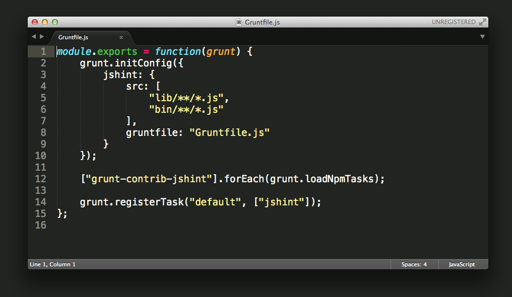

# DeadCode
The best theme for Vim, Atom and Sublime Text.

## Sublime Text

1.	Open Sublime text and click on **Preferences -> Browse Packages**
2.	Then put the sublime_text folder there
3.	Now you should be able to select your custom themes by browsing **Preferences -> Color Scheme -> Colorsublime-Themes**

## Atom
Not available yet.

## Vim
Put `deadcode.vim` file in your `~/.vim/colors/` directory and add the following line to your vimrc file:

    syntax enable
    set number
    colorscheme deadcode

OS X Hint: `vim /usr/share/vim/vimrc`

### About

**License:** MIT ® [Raphael Amorim](https://github.com/raphamorim)
