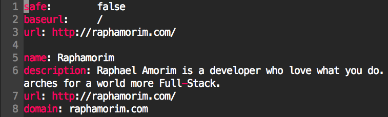
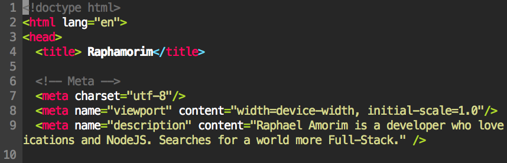

# DeadCode
The best theme for Vim, Atom and Sublime Text

Some examples:

## Sublime Text
Not available yet.

## Atom
Not available yet.

## Vim
Put `deadcode.vim` file in your `~/.vim/colors/` directory and add the following line to your vimrc file:

    syntax enable
    set number
    colorscheme deadcode

OS X Hint: `vim /usr/share/vim/vimrc`

### About

**License:** MIT ® [Raphael Amorim](https://github.com/raphamorim)
